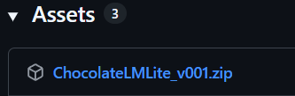

# とにかく始めてみる(最速スタート)
Chocolate LM Liteを使い始める手順を説明します。

## 必要なもの
+ Windowsの入ったPC (一般的な事務用PCスペック)
+ インターネット接続(Wi-Fiでもテザリングでも)

MacやLinux、(高性能なスマホなら)Androidでも動作します。  
ただし、いくらかのコマンド操作が必要です。[リポジトリのビルド手順](https://github.com/gpsnmeajp/ChocolateLMLite?tab=readme-ov-file#%E3%83%93%E3%83%AB%E3%83%89%E6%89%8B%E9%A0%86)をご参照ください。

## AIサービスに登録する

### ご紹介
本アプリケーションは、複数のAIサービスに対応しています。  
初心者には**OpenRouter**がおすすめですので、ここではOpenRouterの使用を前提に説明します。

!!! tips
    + すでに別のAIサービスを契約済みで、APIキーを入手済みの方は、この章を飛ばして下にスクロールしてください。
    + すでにローカルLLMの動作環境を用意してあり、動作確認済みの方も、この章を飛ばして下にスクロールしてください。

**おすすめする理由：**

- **有名サービス** - AI業界で広く使われている信頼性の高いサービス
- **有名なモデルが揃っている** - GPT、Claude、Geminiなど、人気のAIモデル提供会社と公式に連携
- **オープンモデルが使える** - ローカルLLMで同じように使えるオープンモデルが使える
- **無料枠がある** - 最初は課金なしで試せる
- **前払い式** - 利用枠を追加して使う方式で、使いすぎを防げる
- **使った分だけ課金** - 月額料金ではなく、使用量に応じた料金。

**公式サイト**: [https://openrouter.ai/](https://openrouter.ai/)

※無料枠を超える利用にはクレジットカードの登録が必要な点にご注意ください。  
 本ページでは解説しませんが、無料にこだわる場合はGeminiの方が無料枠が広いようです。

!!! warning "重要"
    どのAIサービスを使う場合でも、無料枠や無料モデルは入出力が記録・分析される規約になっています。  
    プライバシーを重視する場合は、有料モデルを使うか、ローカルLLMを検討してください。  
    (有料と言っても、1回の生成につき数円未満の場合が多いです)

    情報収集は、OpenRouterの[プライバシー設定](https://openrouter.ai/settings/privacy)で調整できますが、オフにすると無料モデルは使用できなくなります。

### 登録手順
登録するには、

+ まず[公式サイト](https://openrouter.ai/)に行きます。
+ 右上の「Sign up」ボタンを押します。
+ Googleアカウントのボタン押すか、登録したいメールアドレスとパスワードを入れ、利用規約を読んで同意したらチェックを入れて、Continueを押します。

!!! tips
    この手順では、一旦無料で使えるモデルで説明します。

    もし、「今すぐGPT-4oとかGPT-5とかClaude Sonnet 4とかを使いたい」という方は、そのまま右上のメニューから「Credits」を選択して、Add Creditsボタンから課金してください。一旦は$10 (1500円程度)課金すれば、十分色々楽しめると思います。

### APIキーの入手
次にAPIキーを入手します。

+ 右上のメニューから、「Keys」を選択 (あるいは[ここをクリック](https://openrouter.ai/settings/keys))
+ 「Create API Key」の青いボタンをクリック
+ 名前欄に適当な名前を入力して「Create」をクリック
+ API Keyが表示されますので、コピーボタンを押してコピーして、メモ帳などに取っておいてください。

これでAIサービスへの登録は完了です。

### 図で説明
右上のメニューから、「Keys」を選択 (あるいは[ここをクリック](https://openrouter.ai/settings/keys))

「Create API Key」の青いボタンをクリック

名前欄に適当な名前を入力して「Create」をクリック

 

API Keyが表示されますので、コピーボタンを押してコピーして、メモ帳などに取っておいてください。

!!! warning
    このAPIキーを他人に渡したり見せたりすると、勝手にAIを使われてしまいます。  
    課金が減ったり、犯罪に使われることもありますので、絶対に他人に渡さないでください。  
    APIキーは、一度画面を閉じると二度と表示されませんが、何度でも削除して作り直すことが出来ます。  

## ダウンロードと準備

まず、ダウンロードしましょう。

+ [ここをクリックしてダウンロードページを開きます。](https://github.com/gpsnmeajp/chocolatelmlite/releases)
+ 下の方にAssetsがあり、その中に「ChocolateLMLite_vXXX.zip」がありますので、それをクリックしてダウンロードします。
+ 「未確認のファイル」など表示された場合は、許可してください。
+ 解凍ツールを使うか、zipファイルを右クリックして「すべて展開」をクリックして、zipファイルを展開します。展開先はデスクトップなどのお好みの場所で問題ありません。

## 起動

`0_ChocolateLMLite_vXXX.exe` をダブルクリックして起動します。

初回起動時、Windowsから「WindowsによってPCが保護されました」という警告が出る場合があります  
その場合

- 「詳細情報」をクリック
- 「実行」ボタンをクリック

以下のようなファイアーウォール警告が出た場合は、許可してください。  
(拒否でも動きますが、後々スマホからアクセスできなくなる可能性があります)

以下のような表示が出れば起動成功です。
この画面は閉じずに放置してください。

問題がなければ、自動でブラウザが起動し、Chocolate LM Liteのようこそ画面が出ます(Windowsのみ)  
開かない場合は、[http://127.0.0.1:8010](http://127.0.0.1:8010)を開いてください。

!!! warning
    フォルダ内に大量のファイルがありますが、すべて必要なので移動したり消したりしないでください。

!!! warning
    フォルダの場所は任意ですが、置かないほうが良い場所はあります。
    + 「ダウンロード」フォルダのまま使うと、後で自動削除される可能性があります。必ず別の場所に移動してください。  
    + Program FilesやAppDataなどのシステムフォルダでは正常に動作しないため、避けてください。
    + OneDrive上では、ときどきうまく動かないかもしれません。

!!! tips
    うまく起動しない場合は、展開からやり直してください。
    logsフォルダ内のログファイルに情報がある場合があります。

!!! tips
    MacやLinux、Androidは[リポジトリのビルド手順](https://github.com/gpsnmeajp/ChocolateLMLite?tab=readme-ov-file#%E3%83%93%E3%83%AB%E3%83%89%E6%89%8B%E9%A0%86)をご参照ください。

!!! notice
    このアプリは個人開発者が公開しているため、未確認の発行元としてWindowsの警告が出ることがあります。  
    ウィルス検査をして出荷していますが、誤検知されることはあります。  
    もしEXE形式が信用できない場合は、ご自身での[ビルド手順](https://github.com/gpsnmeajp/ChocolateLMLite?tab=readme-ov-file#%E3%83%93%E3%83%AB%E3%83%89%E6%89%8B%E9%A0%86)をおすすめします。 

## 初期設定

まず、使い始めるための設定をしましょう。

「はじめる」をクリック後、ペルソナ選択画面が出ますので、右上の歯車マークをクリックします。

システム設定画面が開きますので、以下の情報を入力してください。

+ BaseURL: `https://openrouter.ai/api/v1`
+ APIキー: `さきほどAIサービスからコピーしてきたAPIキー`
+ 既定の言語モデル: `openai/gpt-oss-20b:free` 

入力が終わったら、**「保存」ボタンを押してから** 「戻る」を押してください。

!!! tips
    ここでは、無課金でも試せる `openai/gpt-oss-20b:free` を案内しています。  
    以下の点に注意してください。
    
    + このモデルの性能はあまり高くなく、ビジネス用途はともかくとして、キャラクター用途には向いていません。
    + 無料モデルプロバイダーのため、入出力内容は研究用途に記録されます。

    課金済みの場合は、最初から入力されている `google/gemini-2.5-flash` のままで構いません。安価で楽しむことが出来ます。また、`openai/gpt-4o`, `openai/gpt-5-chat` などを使用することも出来ます。

    他におすすめのモデルについては、[こだわり調整](2_tune.md) でご紹介ますので、まずは動作確認を済ませてください。

!!! tips
    もし、既にOpenRouter以外のAIサービスを契約していて、BaseURLやAPIキーが分かる場合はそれが使用できます。  

## はじめてのペルソナ
AIと会話してみましょう。

新しいペルソナを作るには、**「新規作成」ボタン**を押します。

ペルソナに名前をつけて**「作成」ボタン**を押すと、一覧に新しいペルソナが増えます。

選択すると、会話画面に移動します。

会話画面の使い方は、一般的なAIチャットアプリケーションと同様です。  
テキストを入れて**「送信」ボタン**あるいはEnterキーを押すと送信されます。改行はShift+Enterキーです。  

**「添付」ボタン**を押すと、画像が添付できます。

!!! warning
    一般に画像は処理が高額になる(文字とは別料金)なのでご注意ください。   
    べらぼうに高くはなりにくいように設計していますが、それでも多少チャージ額の減りが早くなります。

例えば、「こんにちは」と入力すると以下のようになります。

## ペルソナ設定

このまま会話を楽しむことも出来ますが、ペルソナをカスタマイズすることが出来ます。  
右上の歯車マークを押すと、ペルソナ設定画面に入ります。

ペルソナ設定画面では、名前の変更や、アイコン、背景画像の設定、メモリの確認などが出来ます。  
そして重要なのが**システムプロンプト**です。

AIの振る舞いを根本から設定することが出来ます。

試しに「俺様キャラとして振る舞って」と入れると、キャラクターの振る舞いが苦手なgpt-ossでも、以下のように振る舞いが変わります。

ペルソナ一覧画面に戻るには、左上のボタンを押します。

!!! tips
    システムプロンプトは、常に適用される非常に強力な指示です。  
    一般のAIサービスのプロンプトより遥かに強力に効くため、必要に応じて調整が必要です。

    また、システムプロンプトに何でも入れてよいというわけではなく、言語モデルの安全基準にぶつかったり、LLMプロバイダーの安全基準に引っかかると、軽い場合で応答拒否、(米国法違反などの内容を含む)最悪の場合は人手によるチェックの上、利用権限の剥奪などが起きますので、設定内容は注意してください。

## 会話統計機能と休憩促進について

本アプリケーションには、AI利用の健康被害の防止のため、セルフホスト型のソフトウェアとしては先進的な会話統計機能と休憩促進機能を搭載しています。

これは、会話の回数や、直近8時間以内のユーザーの発言数を常に表示し、一定値を超えた際に休憩を促す機能です。

この情報はAIにも自動送信されるため、休憩が必要と判断されたときにはAIから休憩を促されることがあります。

!!! tips
    休憩基準や、AIに送信するかなどは、システム設定から調整できます。

## 料金について

OpenRouterをご利用の場合は、利用料金について定期的にご確認ください。

+ [現在のチャージ残額の確認は、Creditsページを](https://openrouter.ai/settings/credits)
+ [会話1回あたりの消費などの確認は、Activityページを](https://openrouter.ai/activity)

それぞれご確認ください。

## OpenRouterでおすすめのモデル

最後に、おすすめのモデル(無料・有料)を以下に示します。

無料モデルは、入力された情報を収集し、訓練に使ったり研究機関に提供します。(その対価として無料で利用できます)  
情報収集は、OpenRouterの[プライバシー設定](https://openrouter.ai/settings/privacy)で調整できますが、オフにすると無料モデルは使用できなくなります。  
(逆に有料モデルで情報収集を許可すると割引もあります。)

| モデル名 | 入力料金 | 出力料金 | 特徴 | プライバシー |
|---------|------|----------|------|------------|
| `z-ai/glm-4.5-air:free` | 無料 | 無料 | 自由度が高く創作能力も良い、性能を期待しすぎないこと。 | ⚠️ ログ収集あり |
| `openai/gpt-oss-20b:free` | 無料 | 無料 | ローカルLLMでは一般PCでもギリ動くが性能悪いし自由度は低め | ⚠️ ログ収集あり |
| `cognitivecomputations/dolphin-mistral-24b-venice-edition:free` | 無料 | 無料 | 比較的自由度は高め | ⚠️ ログ収集あり |
| `qwen/qwen3-235b-a22b:free` | 無料 | 無料 | ローカルLLMの定番 | ⚠️ ログ収集あり |
| `google/gemini-2.5-flash` | $0.30/M input tokens | $2.50/M output tokens | 創作能力はかなり高めだが自由度は微妙 | ✅ プライバシー保護 |
| `google/gemini-2.5-pro` | Starting at $1.25/M input tokens | Starting at **$10/M** output tokens | 創作能力は最高クラスだが自由度は微妙(そして高価) | ✅ プライバシー保護 |
| `openai/gpt-5` | $1.25/M input tokens | **$10/M** output tokens | 最新のGPTモデル(そして高価) | ✅ プライバシー保護 |
| `openai/gpt-4o` | Starting at $2.50/M input tokens | Starting at **$10/M** output tokens | みんな大好きGPT-4o(そしてめちゃ高価) | ✅ プライバシー保護 |
| `openai/gpt-4.1` | Starting at $2/M input tokens | Starting at **$8/M** output tokens | コスパの良いGPT(そして高価) | ✅ プライバシー保護 |
| `qwen/qwen3-235b-a22b-2507` | $0.08/M input tokens | $0.55/M output tokens | ローカルLLMの定番だが創作にはそこそこ。そして激安。 | ✅ プライバシー保護 |
| `z-ai/glm-4.5` | $0.38/M input tokens | $1.60/M output tokens | 比較的自由度が高く創作能力も良いが、低速。 | ✅ プライバシー保護 |
| `z-ai/glm-4.5-air` | $0.14/M input tokens | $0.86/M output tokens | 比較的自由度が高く創作能力も良いが、性能を期待しすぎないこと。 | ✅ プライバシー保護 |
| `anthropic/claude-sonnet-4` | Starting at **$3/M** input tokens | Starting at **$15/M** output tokens | 創作能力はかなり高めだが高価 | ✅ プライバシー保護 |
| `anthropic/claude-opus-4` | **$15/M** input tokens | **$75/M** output tokens | 創作能力は最高クラスだが超高額なのでまったくおすすめしません！すぐにクレジットが空になります！ | ✅ プライバシー保護 |

!!! tips
    記載の料金は、2025年10月時点のものです。提供されるモデルは日々変わります。   
    最新の情報は[OpenRouter公式](https://openrouter.ai/models)を参照してください。

!!! tips "M Tokensとは？"
    - 日本語は1文字が1トークンに近い。英語は単語に近い。
    - 例: 「こんにちは」は5トークン、「Hello」は1トークンに相当したりする。
    - 1M Tokensは約100万文字（日本語の場合）
    - つまり、$1/M input tokensは、約100万文字の入力で1ドルかかる計算。

!!! tips "Starting atとは？"
    料金が使用量に応じて変動することを意味します。たいてい、一定量を超えると2倍とかの値段になります。要注意です。  
    OpenRouterの[Models](https://openrouter.ai/models)ページで、各モデルの料金体系を確認できます。

!!! question "「自由度が低い」とは？"
    API利用でも、限定的ながらガードレールは存在しますし、言語モデル自体に拒否能力があります。  
    そのため、特定の表現ができなかったり、特定の話題を避けたりすることがあります。  
    (これは本アプリケーションの仕様ではなく、言語モデルやAPIサービス側の仕様です)

    + 自由度が高いモデルでも、何でも許されるわけではありません。(露骨な表現はNGになる場合が多いです)
    + これを回避しようとする試みはAPI利用規約違反になる場合があります。
    + ローカルLLMでも、同様に拒否が発生する場合があります。

## ペルソナごとに違う言語モデル(例えばGeminiと、Grokと)使い分けたい

ペルソナ設定画面に、ペルソナごとの言語モデル設定があります。  
これを使うと、システム設定画面の言語モデルとは違うものが設定できます。

OpenRouterを使用している場合、各社の言語モデルを自由に併用することが出来ます。

!!! tips
    Q. ローカルLLMや、違うAIサービスと同時に接続できないの？  
    A. 本アプリケーション単体ではできません。(他の高度なAIアプリであればできる場合があります)  
    ※パワーユーザー向け: [LiteLLM Proxy](https://note.com/taku_sid/n/n23d2c914ef11)を立てるとできます。

## おわりに
以上で、「とにかく始めてみる」は終了です。

より多彩に楽しんだり、機能を知りたい場合は [こだわり調整](2_tune.md)  を御覧ください。
