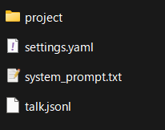

# こだわり調整

基本的な使い方を、[とにかく始めてみる(最速スタート)](1_get-started.md) で学んだ人に、実用的にするためのアドバイスと情報です。

## Chocolate LM Liteの機能について

最速スタートで紹介できていない機能を含め、以下のような機能があります。  
(Howtoツールから引用)

本ページでは、このうち基本的なことを説明します。  
ツールの調整などの細かい応用的なことは、[応用機能のご紹介](3_advanced.md) で改めて紹介します。

```
主な特徴は以下の通りです：
- APIサービスやローカルLLMを設定し、自由な対話が可能
- シンプルな画面で初心者に優しい設計
- 複数のペルソナ(キャラクター)を作成・管理可能(それぞれにシステムプロンプト・モデル・メモリを設定可能)
- タイムスタンプ機能で、時間を考慮した対話が可能
- 自動コンテキストカットオフ機能により、最大長制限なく対話を継続できます
- 仮想スクロール機能で、大量の対話履歴も快適に閲覧可能
- 会話統計機能で、自分がどれだけ会話したか把握可能
- 短時間に大量の会話をした場合、休憩を促すメッセージを表示する機能もあります
- 古い履歴や画像はトークン数節約のため自動的に送信対象から外されます
- メモリ機能で、会話が長引いても重要な情報を保持可能
- Javascriptサンドボックス実行ツールで、正確な計算などが可能
- プロジェクトフォルダ管理機能で、資料を読んだりプログラムを書いたりできます。
- Webhook機能で、AIの発言をDiscordなど外部サービスに転送可能
- タイマーで自発的に発言する機能を搭載
- マルチモーダルLLMによる画像生成機能を備えます
- Model Context Protocolによる外部ツール拡張機能を備え、AIの機能を柔軟に拡張可能
- 定期的な自動アップデートチェック機能を搭載
ぜひChocolate LM Liteをお楽しみください！

注意
- ご利用の際は、各APIサービスの利用規約を遵守してください。
- 生成されたコンテンツの責任はユーザーにあります。
- 外部ツール呼び出しの際に承認や確認は行いません。
- 標準ツールは安全性を考慮していますが、MCPツールなど外部ツールの利用には注意してください。
- 各種ツールはオンオフおよび各種制限調整が可能です。必要に応じて調整してください。(既定では無効になっている機能もあります)
```

## ツールが悪さをするときは

+ Howtoツールを呼び出してAIであることを認識してしまい、ロールプレイが出来ない
+ 現在時刻が原因で、小説に現実の時間が反映されてしまう
+ プライバシーに関する情報を扱っているので、メモリ機能などは無効にしたい
+ 会話の統計情報をいちいち引き合いに出されて困る

そういう場合は、システム設定の応用設定からオフにできます。  
すべてオフにすると、素の言語モデル機能のみになります。

詳しくは、[応用機能のご紹介](3_advanced.md) を御覧ください。


## データ共有の注意点

!!! danger
    general.yaml というファイルは、他人に渡さないでください。APIキーが入っています。

## メモリ機能・プロジェクト機能とかのファイルの場所

EXEファイルの下に`data`というフォルダが出来ています。  
その下に、persona_XXXというフォルダが有り、それがペルソナの本体です。

+ project: プロジェクト機能のフォルダです。AIはこの中に何が入っているのかを知ることができ、テキストなら読み書きもできます。(サブフォルダは使えません)
+ settings.yaml: 名前、モデルなどの設定が入っています。メモ帳で編集できます。壊すと全部消えます。
+ memory.yaml: メモリ機能で保存されるメモリが入っています。メモ帳で編集できます。壊すと全部消えます。
+ system_prompt.txt: システムプロンプトが入っています。メモ帳で編集できます。
+ talk.jsonl: 会話履歴が入っています。メモ帳で編集できます。壊すと全部消えます。

※これらのファイルは、必要が生まれるまで作成されません。

編集する際は必ずバックアップを取ってください。  
EXEファイルの下に`backup`というフォルダには、7日分の自動バックアップがあるので、壊れたときはそこから救出できるかもしれません。



## メモリの確認をしたい・アイコンや背景画像を設定したい

ペルソナ設定画面の下の方にスクロールすると、メモリや画像設定画面が出ます。


## 発言を編集したい

編集ボタンを押すことで編集できます。それより後の発言はすべて削除されます。  


## 会話履歴を残して編集したい

ペルソナ一覧画面の「複製」を押すことで、会話履歴ごとペルソナを複製できます。


## システム設定について

システム設定から以下を設定できます。

+ 画面上のユーザーの名前 : 「あなた」ではなく別の名前で出したいとき
+ 休憩お知らせ基準値 : 休憩お知らせの基準を上げたい・下げたいとき
+ 会話履歴の最大トークン数 : 古い会話もAIに見てほしいとき (これは厳密なトークン数ではなく概算です)
+ ローカルアクセスのみ許可 : ネットワーク内の他の端末からアクセスしてほしくないとき


## ローカルLLMや他のサービスって使えるの？
使えます。ローカルLLMは、LM Studioで調べてみてね。  
(ただし、高スペックのPCが必要になります。ここ1年で劇的に変化しているので、AIに聞くと使い物にならない超高価なものを提案されやすいので気をつけてね)  

!!! tips
    エンドポイント一覧

    - **LM Studio**: `http://127.0.0.1:1234/v1`
    - **Ollama**: `http://127.0.0.1:11434/v1`
    - **OpenAI**: `https://api.openai.com/v1`
    - **Gemini**: `https://generativelanguage.googleapis.com/v1beta/openai/`
    - **Claude**: `https://api.anthropic.com/v1`

## 複数ペルソナを同時に動かしたい

本アプリケーションでは対応していません。  
ポート番号を変えて、他のフォルダに分けることで、複数起動することは出来ます。

## 画像生成
画像生成が出来ます。  
画像生成は、各社仕様がバラバラなので、OpenRouterのみ対応しています。

システム設定の応用設定の最下部に、以下のように設定してください  
(初期設定では無効になっています。)

+ 画像生成を有効化: オン
+ 画像生成LLM Base URL: `https://openrouter.ai/api/v1`
+ 画像生成APIキー: `OpenRouterのAPIキー`
+ 画像生成モデル: `google/gemini-2.5-flash-image` 

[現在使えるモデルは](https://openrouter.ai/models?fmt=cards&output_modalities=image)

+ google/gemini-2.5-flash-image
+ openai/gpt-5-image
+ openai/gpt-5-image-mini

です。

!!! tips
    画像生成はより高価なため、簡易的なロックが掛かっています。  
    自分が頼んだのに「画像生成は高価なためユーザーからの明示的な要求時のみ実行可能です。」というエラーで失敗するときは、「ユーザーが頼んだと設定して」とお願いしてみてください。

    なお、このロックは万能ではないため、タイマー機能をオンにしたまま画像生成を有効にしてると、次々画像を作られてしまうことがあります。「画像生成を有効化」は、不要なときはオフにしておくことをおすすめします。

---

もっと本アプリケーションの機能を詳しく知りたい場合は、[応用機能のご紹介](3_advanced.md) を御覧ください。
