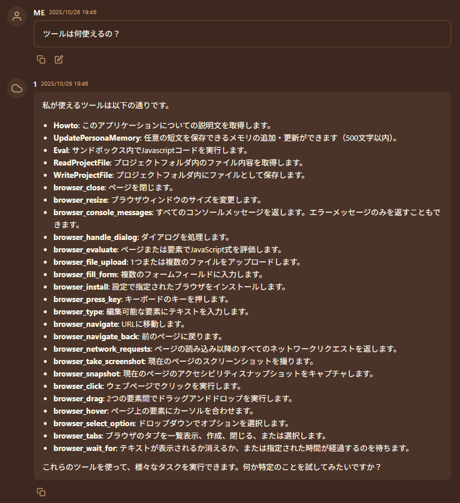
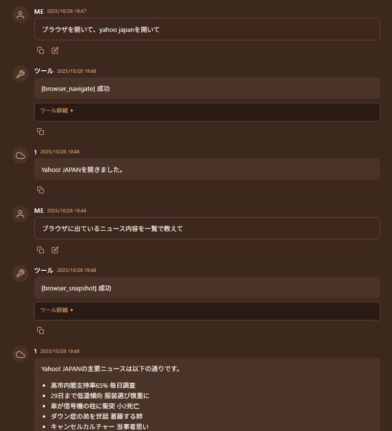

# MCPツール

本アプリケーションは、MCPツールを使って機能を拡張できます。

MCP: Model Context Protocolは、AIの機能を拡張するための規格です。  

さまざまなツールやシステムと連携させることで、AIに様々なことをさせることが出来ます。

例として (これらは動作保証ではありません)

+ [mcp-gemini-cli](https://zenn.dev/choplin/articles/2025-06-28-mcp-gemini-cli-intro): Gemini CLIを使って検索などができます。
+ [switch-bot-mcp-server](https://qiita.com/yasu89/items/a77f5811dba692740e8c): 家電などをAIに制御させたり、気温を確認してもらったり出来ます。
+ [playwright-mcp](https://github.com/microsoft/playwright-mcp): ブラウザを開いて走査してもらうことが出来ます。Webサイトのデバッグなどに。
+ [firecrawl-mcp-server](https://github.com/firecrawl/firecrawl-mcp-server): ネットを横断検索したり調査してもらうことが出来ます。
+ [Gmail-MCP-Server](https://github.com/GongRzhe/Gmail-MCP-Server): gmailを読んだりメールを遅らせたり出来ます。


!!! danger
    利用するツールによっては、PCを破壊したり、火災を起こしたり、玄関の鍵を開けたり、さまざまなことを起こしてしまうことが出来ます。  
    外部ツールの挙動に関して、本アプリケーションでは一切の制御ができず、一切の責任を負いません。  
    危険性を理解したうえで、安全な範囲でツールを連携させてください。

## 有効化
システム設定画面から、以下の設定を有効にします。

#### MCPツール連携を有効化 (`EnableMcpTools`)
[Model Context Protocol](https://cursor.com/ja/docs/context/mcp)に対応した外部ツールとの連携を有効にします。`data`フォルダ内の`mcp.json`に設定を記述する必要があります。

## mcp.jsonに書き方
[cursor仕様](https://cursor.com/ja/docs/context/mcp)に従います。  
各ソフトを実行するために前提となるソフトウェア(uvやnpxなど)を入れる必要があります。  

MCPサーバーは複数登録することが出来ます。ローカル/リモート両対応です。  
最低限の呼び出し機能だけ対応しているため、高度な機能を前提としているMCPサーバーは動作しないことがあります。  

起動時に一気に読み込むため、起動に時間がかかるようになるかもしれません。  
(追加した後は、再起動してください)

例

``` mcp.json
{
  "mcpServers": {
    "playwright": {
      "command": "npx",
      "args": [
        "@playwright/mcp@latest"
      ]
    }
  }
}
```

正常に読み込まれたかは、

+ ログを確認する
+ 「ツールは何使えるの？」と聞いてみる

ことでわかります。




