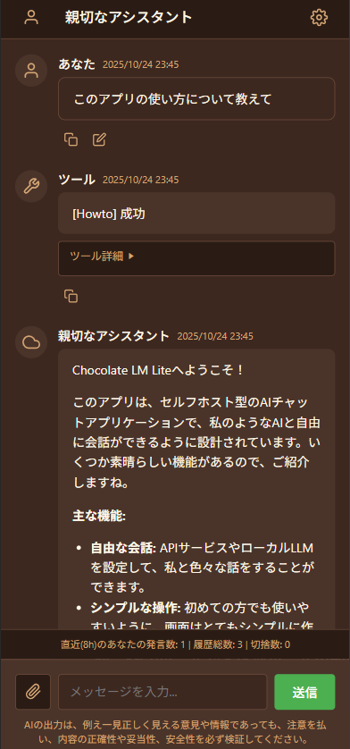
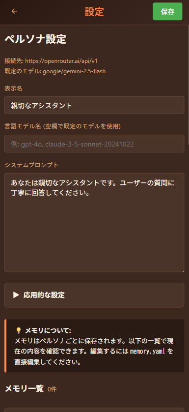

# Chocolate LM Lite 🍫 へようこそ

**Chocolate LM Lite** は、自分のPCで簡単に動かせる、セルフホスト型のAIチャットアプリケーションです。

「日本語話者が簡単に始められるAPI利用LLM」体験を目指して開発されており、セルフホスト型のソフトウェアです。
各種LLMプロバイダーやローカルLLMと接続して、専門知識のない人にも自由で開かれたAI体験ができることを目指して作成されています。

手持ちのPCの上で使ったり、PCをサーバーにしてスマホで使ったり出来ます。データはすべてPCの上に保存されますので、同じ会話を続けることが出来ます。  

LLMプロバイダーを使う場合、高性能なPCは必要ありません。  
1万円～3万円程度で売られている中古PC、使われずにホコリをかぶっているWindowsノートパソコンで十分に動きます。

  

# 説明書準備中